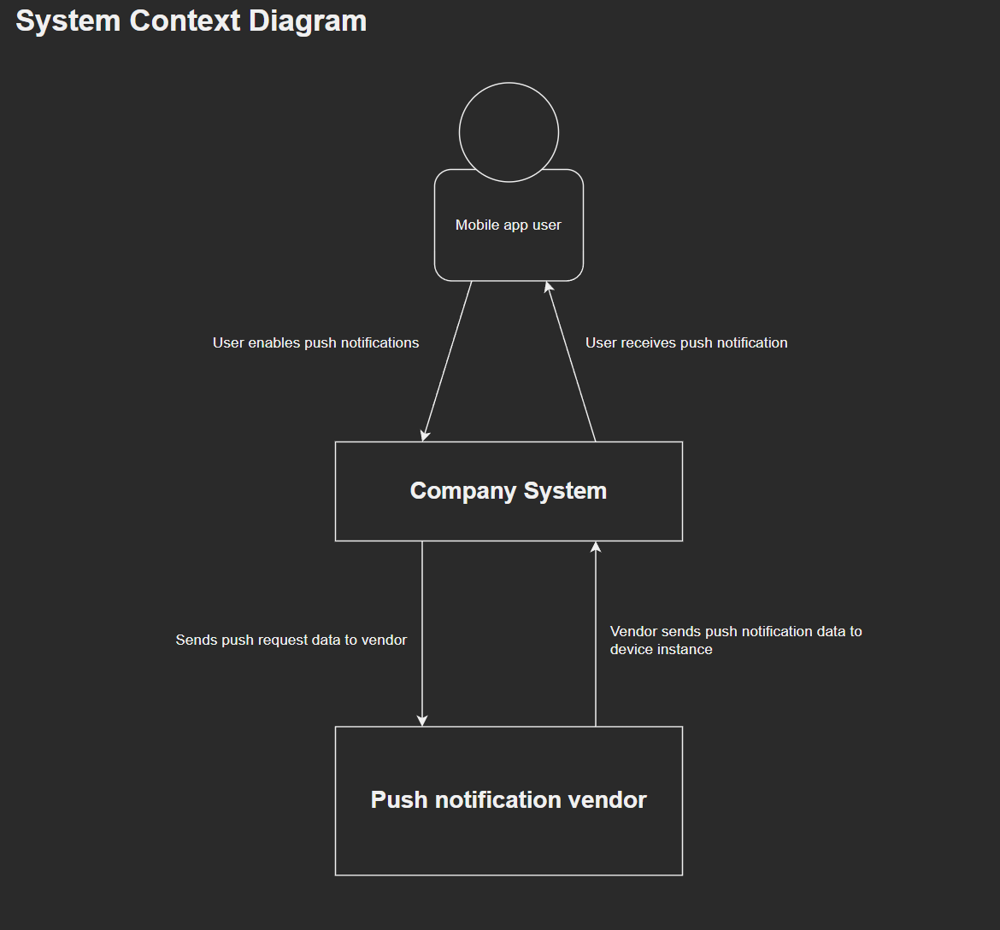
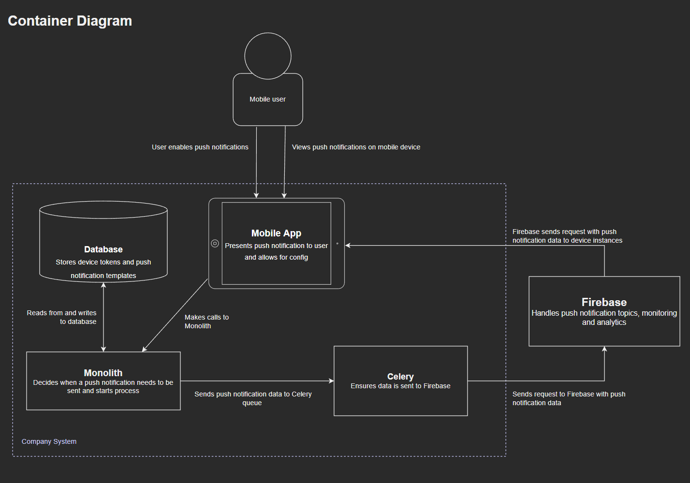
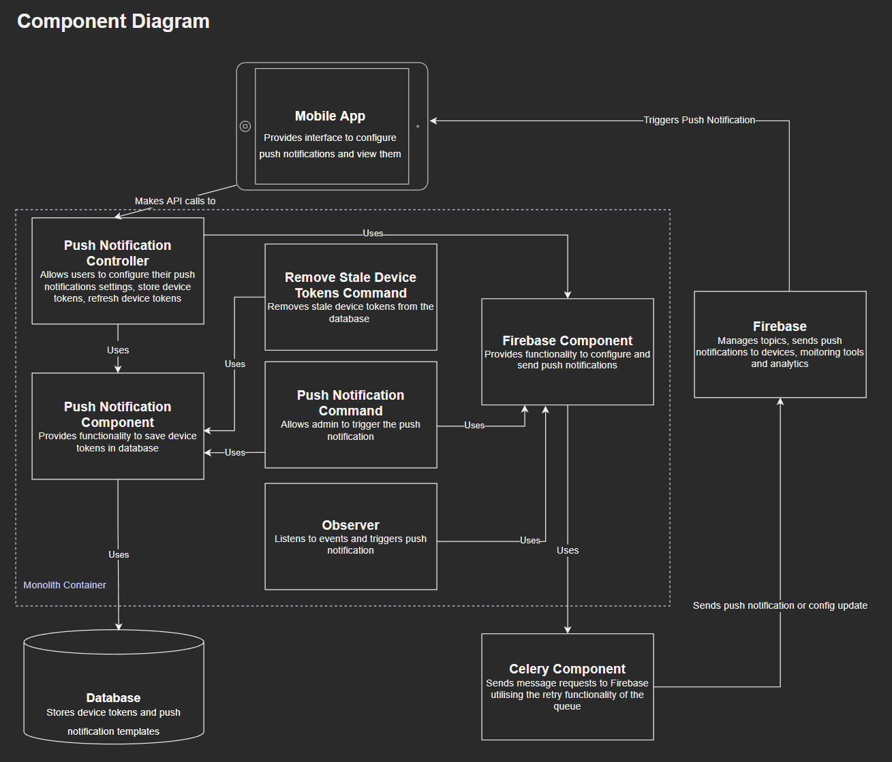

# C4 Model Diagrams

## About C4 Model Diagrams

- The C4 model was created as a way to help software development teams describe and communicate software architecture
- It's a way to create maps of your code, at various levels of detail.
- [Read more about C4 diagrams](https://c4model.com/)

## Diagrams

